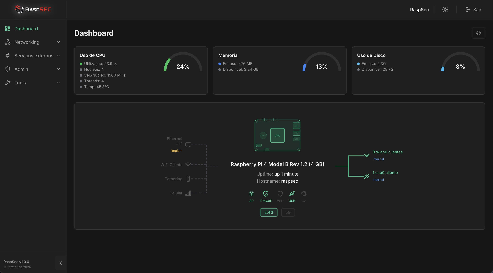
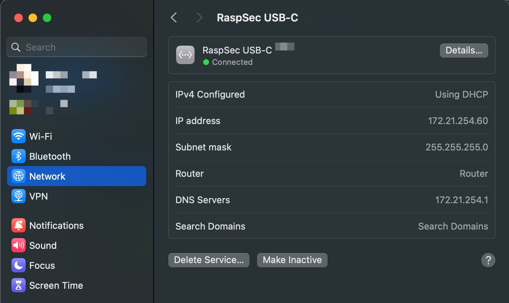
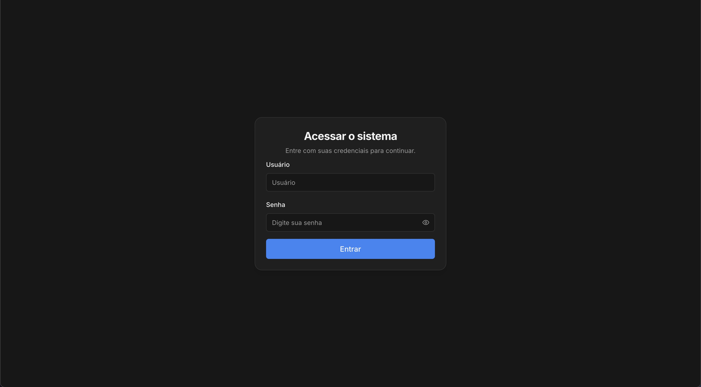
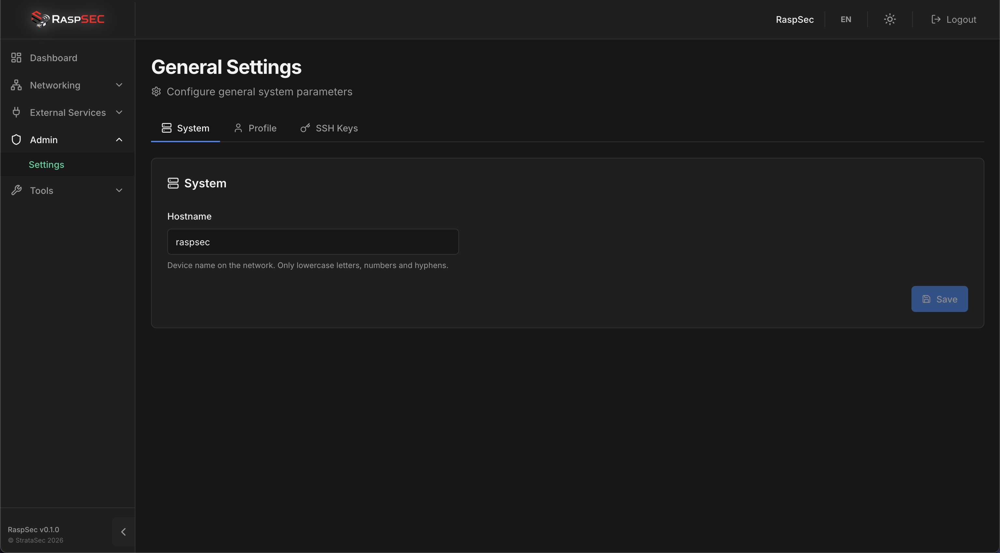
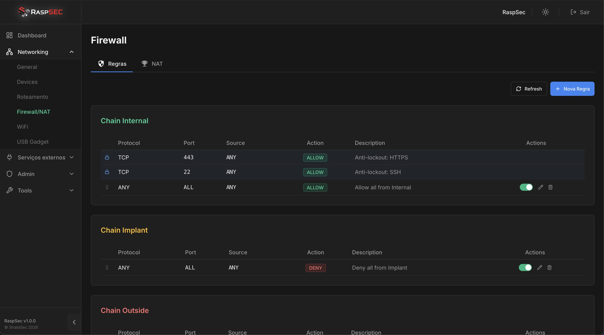
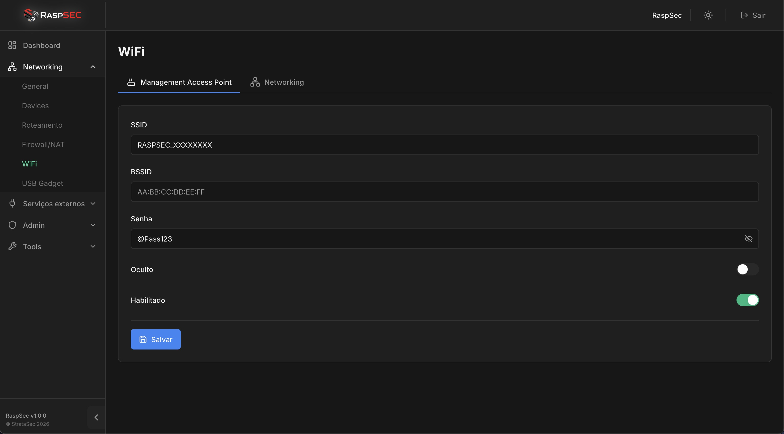

# RaspSec

**RaspSec** is a security-focused operating system for Raspberry Pi, designed for network security operations, penetration testing, and red team engagements. It transforms a Raspberry Pi into a portable, fully managed network implant with a modern web interface.

<!-- Screenshot: Dashboard overview -->
<!--  -->

---

## Features

- **Web Management Interface** — Modern React-based dashboard accessible via HTTPS
- **WiFi Access Point** — Built-in 2.4G/5G AP for management and client connectivity
- **Firewall** — Configurable iptables-based firewall with chain-based routing (implant/outside/internal)
- **USB-C Ethernet** — Automatic RNDIS/Ethernet gadget over USB-C for direct laptop connection
- **WiFi Client** — Connect to external networks (WPA2/WPA3/802.1X) as an uplink
- **Sliver C2** — Integrated Sliver C2 framework support
- **VPN Support** — Detection and routing for VPN interfaces (tun0, wg0, ppp0)
- **DNS Management** — Custom DNS configuration and blocklists
- **VLAN Support** — Create and manage 802.1Q VLANs
- **Static Routes** — Advanced routing configuration
- **Packet Capture** — Built-in packet capture tools
- **Spectrum Analyser** — WiFi spectrum analysis via WebSocket
- **Web Shell** — Integrated terminal via browser

---

## Supported Hardware

| Board | Status |
|-------|--------|
| Raspberry Pi 4 Model B | Supported |
| Raspberry Pi 5 | Supported |

> Requires a 64-bit ARM (aarch64) Raspberry Pi with at least 2 GB of RAM.

---

## Quick Start

### 1. Flash the Image

Download the latest `.img.zip` from the [Releases](https://github.com/helviojunior/raspsec/releases) page.

Flash it to a microSD card using one of these tools:

- [Raspberry Pi Imager](https://www.raspberrypi.com/software/) (recommended)
- [balenaEtcher](https://etcher.balena.io/)
- CLI: `unzip raspsec.img.zip && sudo dd if=raspsec.img of=/dev/sdX bs=4M status=progress`

> **Important:** Do not change the hostname or user settings in Raspberry Pi Imager. The image is pre-configured.

### 2. Boot and Connect

Insert the microSD card into your Raspberry Pi and power it on. There are **two ways** to connect:

---

#### Option A: WiFi Access Point

The Raspberry Pi creates a WiFi network on boot:

| Setting | Value                              |
|---------|------------------------------------|
| **SSID** | `RASPSEC_XXXXXXXX`                   |
| **Password** | `@Pass123`                         |
| **Interface IP** | `172.21.255.1`                     |
| **DHCP Range** | `172.21.255.50` - `172.21.255.100` |

Connect to the `RASPSEC_XXXXXXXX` WiFi network, then open your browser:

```
https://172.21.255.1
```

---

#### Option B: USB-C Ethernet (Recommended for laptops)

Simply plug a USB-C cable between the Raspberry Pi's **USB-C power port** and your laptop. The Pi will:

1. Power on from the laptop's USB port
2. Create a virtual Ethernet (RNDIS) network interface on your laptop
3. Assign your laptop an IP via DHCP

| Setting | Value |
|---------|-------|
| **Interface** | `usb0` |
| **Pi IP** | `172.21.254.1` |
| **DHCP Range** | `172.21.254.50` - `172.21.254.100` |

Once connected, open your browser:

```
https://172.21.254.1
```

> Your laptop will see a new network adapter named similar to "RaspSec USB-C XXXXXX" or "USB Ethernet/RNDIS Gadget". No drivers needed on Linux/macOS. Windows may require the RNDIS driver.

<!-- Screenshot: USB-C connection diagram -->
<!--  -->

---

### 3. Login to the Web Interface

Open `https://<IP>` in your browser and accept the self-signed certificate warning.

| Setting | Value |
|---------|-------|
| **Username** | `raspsec` |
| **Password** | `@Pass123` |

<!-- Screenshot: Login page -->
<!--  -->

> **Important:** Change the default password after your first login via **Admin > Settings**.

<!-- Screenshot: Settings page -->
<!--  -->

---

### 4. SSH Access

SSH is available with the same credentials:

```bash
ssh raspsec@172.21.255.1
# or via USB-C:
ssh raspsec@172.21.254.1
```

| Setting | Value |
|---------|-------|
| **Username** | `raspsec` |
| **Password** | `@Pass123` |

---

## Default Network Configuration

```
                                    ┌─────────────────┐
    WiFi AP (RaspSec)               │                 │
    172.21.255.1/24  ──────────────>│   Raspberry Pi  │
                                    │     RaspSec     │
    USB-C Ethernet                  │                 │
    172.21.254.1/24  ──────────────>│                 │
                                    └─────────────────┘
```

| Interface | Type | Default IP | Role |
|-----------|------|-----------|------|
| `wlan0` | WiFi AP | `172.21.255.1/24` | Management / Internal |
| `usb0` | USB-C Ethernet | `172.21.254.1/24` | Management / Internal |
| `eth0` | Ethernet | DHCP | Implant / Uplink |

### Firewall Chains

RaspSec uses a chain-based routing model to separate network traffic by purpose. Each network interface is assigned to a chain that determines how traffic is routed and filtered.

```
                  ┌──────────────────────────────────────┐
                  │             RaspSec                   │
                  │                                      │
  ┌─────────┐    │  ┌──────────┐    ┌──────────────┐    │    ┌──────────┐
  │ Target   │◄──►│  │ Implant  │    │   Internal    │    │◄──►│ Attacker │
  │ Network  │    │  │  Chain   │◄──►│    Chain      │    │    │ Machine  │
  └─────────┘    │  └──────────┘    └──────────────┘    │    └──────────┘
                  │                    ▲                  │
                  │                    │                  │
                  │                  ┌─┴────────┐        │
                  │                  │ Outside   │        │
                  │                  │  Chain    │        │
                  │                  └──────────┘        │
                  │                    ▲                  │
                  └────────────────────│──────────────────┘
                                       │
                                  ┌────┴─────┐
                                  │ Internet  │
                                  └──────────┘
```

| Chain | Color | Purpose | Description |
|-------|-------|---------|-------------|
| **Internal** | Blue | Attack network | Interfaces that serve your attack machines (laptops, tablets). The WiFi AP and USB-C Ethernet are internal by default. Traffic from internal clients is routed to the implant and outside chains. |
| **Outside** | Red | Internet uplink | Interfaces that provide internet connectivity (mobile tethering, WiFi client to an external network). Used for C2 callbacks, tool downloads, and exfiltration. |
| **Implant** | Yellow | Target network | Interfaces connected to the target/client network being assessed. Typically the Ethernet port plugged into the target's infrastructure. Traffic between internal and implant is routed through the firewall. |

**Typical deployment scenario:**

1. Plug the Pi's **Ethernet** (`eth0`) into the target network switch &rarr; **Implant** chain
2. Connect your phone/USB 4G dongle via **USB tethering** for internet &rarr; **Outside** chain
3. Connect your laptop to the **WiFi AP** or **USB-C** &rarr; **Internal** chain
4. Your laptop can now reach the target network through the Pi, while C2 traffic goes out through the phone's internet connection

> Each interface's chain can be changed via **Network > Devices** in the web interface.

---

## Web Interface

<!-- Screenshot: Dashboard with system stats -->
<!--  -->

The web interface provides:

- **Dashboard** — System overview, CPU/Memory/Disk usage, network topology, active services
- **Network > Devices** — Manage network interfaces, WiFi mode, chains
- **Network > WiFi** — Configure Access Point (SSID, password, channel, band)
- **Network > DNS** — DNS servers, blocklists, custom entries
- **Services > Firewall** — Firewall rules and chain routing
- **Services > USB Gadget** — USB-C Ethernet configuration
- **Services > Sliver C2** — Command and control framework
- **Tools > Packet Capture** — Capture network traffic
- **Tools > Spectrum Analyser** — WiFi spectrum analysis
- **Tools > Web Shell** — Browser-based terminal
- **Admin > Settings** — Change password, system configuration

<!-- Screenshot: Firewall configuration -->
<!--  -->

<!-- Screenshot: WiFi AP configuration -->
<!--  -->

---

## Default Credentials Summary

| Service | Username | Password |
|---------|----------|----------|
| Web Interface | `raspsec` | `@Pass123` |
| SSH | `raspsec` | `@Pass123` |
| WiFi AP | — | `@Pass123` |

> Change all default credentials before deploying in a real engagement.

---

## License

This project is licensed under the Apache License 2.0 — see the [LICENSE](LICENSE) file for details.

---

## Disclaimer

RaspSec is intended for authorized security testing, research, and educational purposes only. Always obtain proper authorization before deploying on any network. The authors are not responsible for misuse.
